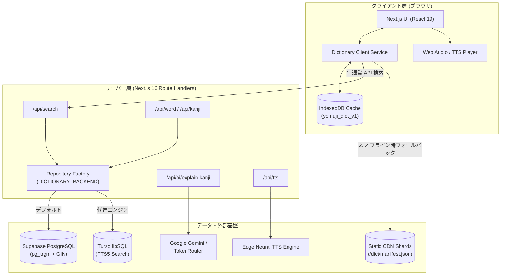

[English](./README.md) | **日本語**

<div align="center">
  
  <h1>YomuJi (読む字)</h1>
  <p><strong>即時検索・言語学的知見・オフライン耐性を両立した、モダンな日越辞典・日本語学習プラットフォーム</strong></p>
  <p>
    <a href="https://github.com/epauengi/YomuJi">GitHub リポジトリ</a>
  </p>
</div>

<p align="center">
  
  
  
  
  
  
</p>

---

## 概要

**YomuJi（読む字）** は、ベトナム語話者向けの日本語学習・辞典プラットフォームです。従来の学習環境において「単語検索」「漢字の筆順確認」「長文読解練習」「活用形の確認」「語源・語彙のニュアンス理解」が別々のツールに分断されていた課題を解決するために開発されました。

本システムは、**196,583 件の語彙**、**10,355 字の漢字**、**31,571 件の用例**、および **6,700 件以上のベクター筆順 SVG データ** を収録しています。サーバーサイドの高速全文検索に加え、ブラウザ上の IndexedDB を活用したシャーディングキャッシュ構造を採用し、ネットワークが不安定または切断されたオフライン環境下でも停止しない堅牢な検索体験を提供します。

---

## 主な機能

- **マルチモーダル統合検索**: 漢字・かな（ひらがな/カタカナ）・ローマ字・ベトナム語訳を1つの検索窓で即座に判定。ダイアクリティカルマーク（声調記号）の正規化と多段階スコアリングによる的確な結果表示。
- **ハイブリッド構成とオフライン耐性**: 高速なクラウドバックエンド（PostgreSQL / libSQL）を優先参照し、通信途絶時にはブラウザ内 IndexedDB（`yomuji_dict_v1`）の静的インデックスへ自動フォールバック。
- **インタラクティブ読解アシスタント**: Wikipedia 記事の動的取得、クリック即時辞書引き、ルビ（ふりがな）自動表示、縦書き表示切り替え（`tategaki`）、Neural TTS による全文音声読み上げ。
- **漢字筆順アニメーション**: 10,000字以上の漢字に対応した SVG 筆順アニメーション。一時停止、コマ送り、部首・画数分解表示。
- **AI による言語学的解説**: 漢字の成り立ち（象形・会意・形声）、記憶用ニーモニック（覚え方）、現代日本語での語感・ニュアンス、JLPT レベル別複合語を、複数プロバイダー（Gemini / TokenRouter）経由で安全に生成・クライアントキャッシュ。
- **文法・活用形エンジン**: 動詞および形容詞の主要9変化（普通形、て形、過去形、仮定形、意志形、命令形、可能形、受身形、使役形）を一覧展開。
- **JLPT ロードマップ**: N5 から N1 までの体系的な語彙分類、今日の単語、フラッシュカード学習プレビュー。

---

## 技術スタック

| カテゴリ | 技術 | 採用理由と役割 |
| :--- | :--- | :--- |
| **フレームワーク** | Next.js 16 (App Router) + React 19 | Server Components、Turbopack、ストリーミング Route Handlers、厳格な `server-only` 境界管理。 |
| **言語** | TypeScript 5.7 | 辞書レコード、API 定義、静的シャード検証における厳格な型安全性の確保。 |
| **スタイリング** | Tailwind CSS v4 | CSS ファースト構成、CSS カスタムプロパティによるデザイントークン、`prefers-reduced-motion` 準拠。 |
| **主データベース** | Supabase (PostgreSQL) | `pg_trgm` GIN インデックスによるトライグラム類似度検索およびベトナム語訳配列インデックス。 |
| **エッジ検索エンジン** | Turso (libSQL) | SQLite FTS5（`unicode61 remove_diacritics 2`）を用いたサブミリ秒の全文検索エンジン。 |
| **オフラインキャッシュ** | IndexedDB (`yomuji_dict_v1`) | 40個の検索シャードと21個の漢字シャードをクライアント保存し、詳細情報は必要に応じて遅延読み込み。 |
| **音声合成** | `@andresaya/edge-tts` | 自然な日本語ニューラル音声合成を `/api/tts` 経由でストリーミング配信。 |
| **アニメーション & アイコン** | Motion (`motion/react` v12) + Phosphor Icons | 物理挙動スプリングアニメーションとアクセシブルなアイコン設計。 |

---

## アーキテクチャ

読み取り負荷の高い静的辞書データとユーザー依存の動的データを分離しつつ、ブラウザ単体で稼働可能なオフラインフォールバック経路を確保しています。



---

## 技術的な工夫・設計判断

### 1. ハイブリッドデータベース設計（Supabase ↔ Turso シャドー検証）

- **課題**: 約20万件の語彙と1万件の漢字データを Supabase 無料枠に格納すると、ストレージ使用量が約 386 MB に達し 500 MB 上限を圧迫する上、サーバーレス環境でのコールドスタートレイテンシが発生していました。
- **対応**: 抽象インターフェース `DictionaryRepository` を定義。認証やユーザー設定などの動的データは Supabase に残し、辞書検索処理を Turso（libSQL FTS5）へ分離可能にしました。また、開発環境で双方に並行クエリを発行して応答速度と結果一致度を計測する `CompareDictionaryRepository` を構築しました。
- **結果**: Turso による高速な全文検索を実現し、Supabase のストレージ消費を大幅に削減。環境変数 `DICTIONARY_BACKEND` の切り替えだけでダウンタイムなしに移行できる構成を確立しました。

### 2. 多層フォールバックと静的シャードによるゼロレイテンシ検索

- **課題**: モバイル利用時や移動中の通信遮断時でも、辞書としての基本機能を失わない信頼性が求められていました。
- **対応**: **メモリキャッシュ → IndexedDB → 静的シャード同期 → リモート API** の4階層フォールバックを実装。ビルドスクリプト `scripts/build-dictionary.ts` により、辞書データを40個の検索シャード、21個の漢字シャード、99個の詳細シャードに事前分割。起動時に軽量な検索インデックスのみを IndexedDB に取り込み、詳細データはアクセス時にオンデマンドで遅延取得します。
- **結果**: 完全なオフライン環境でも瞬時に検索候補を表示可能になり、初期読み込み時の通信量を最小限に抑えました。

### 3. 多重フォールバックを備えた AI 言語解説ルーター

- **課題**: LLM を用いた漢字の成り立ちやニュアンス解説は、単一プロバイダーのレート制限やレスポンス形式の乱れ（JSON 崩れ）による障害リスクを伴います。
- **対応**: サーバーサイドエンドポイント `/api/ai/explain-kanji` を構築し、以下の安全設計を導入しました。
  - **入力検証**: 漢字一文字であることを正規表現（`/^\p{Script=Han}$/u`）で厳格に判定し、プロンプトインジェクション耐性のある構造化入力を作成。
  - **カスケードフォールバック**: TokenRouter（Qwen / DeepSeek）を試行後、タイムアウトまたは失敗時に Google Gemini（Flash-Lite 系列）へ自動切替。
  - **スキーマ検証**: 取得した JSON を独自の TypeScript 型ガードで全項目検証。
  - **クライアントキャッシュ**: 文字ごとに `localStorage`（`yomuji_ai_kanji_{literal}`）へ永続化し、同一文字の重複課金とレイテンシを防止。
- **結果**: 外部障害時でも UI をブロックしない、安定した漢字解説機能を実現しました。

### 4. ベクター筆順アニメーションの内製エンジン

- **課題**: 漢字の筆順表示のために外部の iframe や重量級ライブラリを使用すると、テーマ連動やパフォーマンスに制約が生じます。
- **対応**: KanjiVG のパス構造と AnimCJK のシェイプ定義の双方に対応した SVG パーサーを `StrokeAnimator.tsx` として内製。`strokeDasharray` と `strokeDashoffset` を動的制御し、再生・一時停止・コマ送り・部首ガイド表示を滑らかに行います。また `useReducedMotion` を組み込み、アクセシビリティ設定にも配慮しました。
- **結果**: 外部依存なしに 60 FPS で動作する軽量な筆順アニメーションを実現しました。

---

## UI / UX 設計

- **テーマ切り替え**: CSS カスタムプロパティ（`--color-background`, `--color-surface` など）を `ThemeManager.tsx` で一括制御。ライト・ダーク・OS 連動に対応し、ちらつき（FOUC）のない描画を維持。
- **アクセシビリティ**: スキップリンク（「Nhảy đến nội dung chính」）、セマンティックマークアップ、ARIA 属性、キーボード操作に対応した検索コンボボックス。
- **レスポンシブ対応**: モバイル環境では片手操作に適したボトムナビゲーションを配置し、デスクトップでは一覧性を高めたレイアウトへ最適化。

---

## セットアップ

### 必要要件

- Node.js 20.x 以上
- npm

### 手順

1. **リポジトリのクローン:**
   ```bash
   git clone https://github.com/epauengi/YomuJi.git
   cd YomuJi
   ```

2. **依存関係のインストール:**
   ```bash
   npm install
   ```

3. **環境変数の設定:**
   ```bash
   cp .env.example .env.local
   ```
   `.env.local` に接続情報を設定します（下記の環境変数一覧を参照）。

4. **開発サーバーの起動:**
   ```bash
   npm run dev
   ```
   ブラウザで [http://localhost:3000](http://localhost:3000) を開きます。

---

## 環境変数

| 変数名 | 必須 | 説明 |
| :--- | :---: | :--- |
| `NEXT_PUBLIC_SUPABASE_URL` | 任意* | Supabase プロジェクト URL。 |
| `NEXT_PUBLIC_SUPABASE_ANON_KEY` | 任意* | Supabase 匿名公開 API キー。 |
| `SUPABASE_SERVICE_ROLE_KEY` | なし | サーバーサイド専用 Supabase 管理キー。 |
| `DICTIONARY_BACKEND` | なし | 辞書バックエンド選択: `supabase`（デフォルト）、`turso`、`compare`。 |
| `TURSO_DATABASE_URL` | なし | Turso libSQL 接続 URL（例: `libsql://your-db.turso.io`）。 |
| `TURSO_AUTH_TOKEN` | なし | Turso 認証トークン（サーバー専用）。 |
| `GEMINI_API_KEY` | なし | 漢字 AI 解説用の Google Gemini API キー（サーバー専用）。 |
| `TOKENROUTER_API_KEY` | なし | 漢字 AI 解説のフォールバック用 TokenRouter API キー（サーバー専用）。 |

*\*補足: Supabase の接続情報を設定しない場合でも、`public/dict` の静的シャードを用いた完全オフラインモードで基本機能が動作します。*

---

## 利用可能なスクリプト

```bash
# Turbopack による開発サーバーの起動
npm run dev

# TypeScript の型チェック
npx tsc --noEmit

# 本番ビルドの作成
npm run build

# 本番サーバーの起動
npm run start

# 静的辞書レコードに対する Turso データの整合性検証
npm run turso:validate
```

*※ Lint に関する注記: Next.js 16 では従来の `next lint` が非推奨となり Flat Config への移行が推奨されています。ESLint 設定の刷新は今後のアップデートで予定されています。*

---

## ディレクトリ構成

```text
src/
├── app/                           # Next.js App Router ページおよびレイアウト
│   ├── api/                       # API Route Handlers
│   │   ├── ai/explain-kanji/      # 多重フォールバック付き AI 漢字解説
│   │   ├── kanji/[slug]/          # 漢字詳細データ取得
│   │   ├── search/                # 統合検索エンドポイント
│   │   ├── tts/                   # 日本語ニューラル音声合成
│   │   └── word/[slug]/           # 語彙詳細データ取得
│   ├── conjugation/               # 活用形一覧
│   ├── flashcards/                # フラッシュカード学習プレビュー
│   ├── jlpt/                      # JLPT レベル別カタログ (N5 - N1)
│   ├── kanji/[slug]/              # 漢字詳細・筆順アニメーション画面
│   ├── search/                    # 検索結果一覧画面
│   ├── settings/                  # 各種設定
│   ├── word/[slug]/               # 単語詳細画面
│   ├── globals.css                # Tailwind 4 トークン定義
│   ├── layout.tsx                 # ルートレイアウト・メタデータ設定
│   └── page.tsx                   # トップ画面（読解アシスタント・検索）
├── components/                    # UI コンポーネント
│   ├── dictionary/                # StrokeAnimator, KanjiCard, TermCard 等
│   ├── ui/                        # Button, Card, Badge, Input 等のプリミティブ
│   ├── BottomNav.tsx              # モバイル用ボトムナビゲーション
│   ├── Navbar.tsx                 # ヘッダーナビゲーション
│   └── ThemeManager.tsx           # テーマ管理
├── hooks/                         # カスタム React フック
├── lib/                           # コアロジック・データアクセス層
│   ├── dictionary/                # リポジトリパターン実装（Supabase, Turso, Compare）
│   ├── browserState.ts            # LocalStorage / テーマイベント制御
│   ├── dictionaryService.ts       # 検索オーケストレーション & IndexedDB 連携
│   ├── navigation.ts              # 検索 URL 生成ヘルパー
│   └── tts.ts                     # 音声再生コントローラー
└── types/                         # TypeScript 型定義
```

---

## ライセンス

本プロジェクトはポートフォリオおよび学習リソースとして開発されています。[MIT License](https://opensource.org/licenses/MIT) のもとで公開されています。
