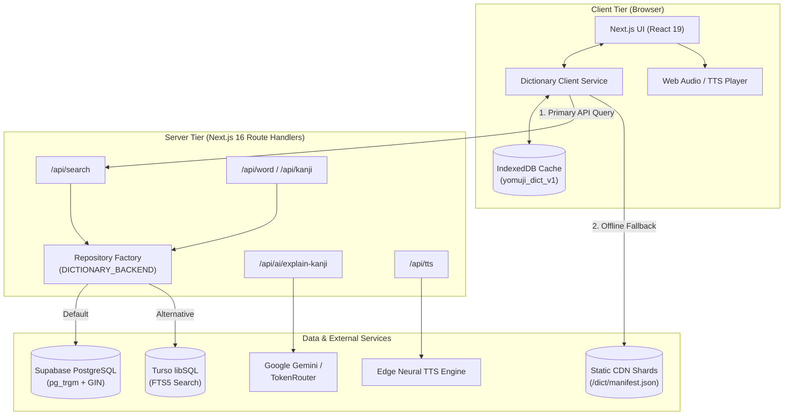

**English** | [日本語](./README.ja.md)

<div align="center">
  
  <h1>YomuJi (読む字)</h1>
  <p><strong>A modern, high-performance Japanese-Vietnamese dictionary and reading ecosystem engineered for instant lookups, linguistic depth, and edge resilience.</strong></p>
  <p>
    <a href="https://github.com/epauengi/YomuJi">GitHub Repository</a>
  </p>
</div>

<p align="center">
  
  
  
  
  
  
</p>

---

## Overview

**YomuJi** is a full-featured Japanese-Vietnamese dictionary and language learning platform. It addresses the fragmentation of existing learning tools—where users must juggle separate resources for vocabulary lookups, kanji stroke animations, reading practice, grammar conjugations, and mnemonics.

The system indexes **196,583 vocabulary terms**, **10,355 kanji characters**, and **31,571 contextual example sentences**, backed by **6,700+ vector stroke-order SVG paths**. Designed with an edge-first mindset, YomuJi combines server-side full-text search with an in-browser sharded IndexedDB cache, guaranteeing instant query responses even during total network failure.

---

## Key Features

- **Unified Multi-Modal Search**: Instant lookups across Kanji, Kana (Hiragana/Katakana), Romaji, and Vietnamese definitions in a single search bar with diacritic-insensitive normalization and multi-tier score ranking.
- **Dual-Engine Server & Offline Resilience**: Queries high-speed cloud backends first (PostgreSQL or libSQL), automatically falling back to an in-browser sharded IndexedDB cache (`yomuji_dict_v1`) without breaking user flow.
- **Interactive Japanese Reading Assistant**: An integrated reading experience featuring live Wikipedia articles, tokenized click-to-lookup, furigana generation, vertical reading toggle (*tategaki*), and full-passage Japanese text-to-speech.
- **Interactive Kanji Stroke Animator**: Dynamic SVG stroke-order playback for 10,000+ Kanji with step-by-step playback, stroke count indicators, and radical breakdowns.
- **AI Linguistic Explanations**: Deep contextual insights for Kanji—covering etymology, mnemonic memory hooks, nuance differentiation, and JLPT-graded compound words—powered by a resilient server-side LLM router (Gemini / TokenRouter).
- **Grammar & Conjugation Engine**: Interactive inflection tables across 9 verbal and adjectival forms (Plain, Te-form, Past, Conditional, Volitional, Imperative, Potential, Passive, Causative).
- **JLPT Progression Roadmap**: Structured learning tracks from N5 through N1 with vocabulary counters, word-of-the-day widgets, and flashcard review previews.

---

## Tech Stack

| Category | Technology | Purpose & Architectural Decision |
| :--- | :--- | :--- |
| **Framework** | Next.js 16 (App Router) + React 19 | Server Components, Turbopack bundling, streaming Route Handlers, and strict server-only boundaries (`import 'server-only'`). |
| **Language** | TypeScript 5.7 | Strict type safety across dictionary models, API contracts, and shard validation guards. |
| **Styling** | Tailwind CSS v4 | CSS-first configuration, zero-runtime tokens, CSS custom property theming, and reduced-motion compliance. |
| **Relational & Search Engine** | Supabase (PostgreSQL) | Primary data layer with `pg_trgm` GIN indexes for trigram matching and array indexing on Vietnamese definitions. |
| **Edge Search Engine** | Turso (libSQL) | Server-side alternative engine using SQLite FTS5 (`unicode61 remove_diacritics 2`) for sub-millisecond full-text queries. |
| **Offline Client Cache** | IndexedDB (`yomuji_dict_v1`) | Browser-side persistent storage for 40 search shards and 21 kanji shards with lazy-loaded detail shards. |
| **Speech Synthesis** | `@andresaya/edge-tts` | High-fidelity Japanese neural voice synthesis served via `/api/tts` with audio streaming. |
| **Animation & Icons** | Motion (`motion/react` v12) + Phosphor Icons | Micro-interactions, spring transitions, and accessible iconography. |

---

## Architecture

The system decouples read-heavy dictionary queries from user-centric state while maintaining a complete offline-capable client fallback:



---

## Technical Highlights & Engineering Decisions

### 1. Decoupled Hybrid Database Architecture (Supabase ↔ Turso Shadowing)

- **Problem**: Loading 196k+ terms and 10k+ kanji into Supabase Free Tier consumed ~386 MB of database storage, rapidly approaching the 500 MB quota while incurring cold-start latency on serverless edge functions.
- **Approach**: Built an abstract `DictionaryRepository` interface. User-specific dynamic data (auth, bookmarks, preferences) remains on Supabase, while read-heavy dictionary queries can route to Turso libSQL with FTS5. Created `CompareDictionaryRepository` to shadow-run queries against both backends in development, profiling latency and validating result parity side-by-side.
- **Result**: Sub-millisecond full-text queries on Turso with zero quota pressure on Supabase and a seamless, zero-downtime migration path toggled via a single environment variable (`DICTIONARY_BACKEND`).

### 2. Tiered Failover & Zero-Latency Sharded Static Offline Index

- **Problem**: Language learners frequently look up vocabulary in low-connectivity mobile environments. An application that fails or hangs during network dropouts degrades user trust immediately.
- **Approach**: Engineered a 3-tier retrieval hierarchy: **In-Memory Cache → IndexedDB Store → Static Shard Sync → Remote API**. Data is pre-compiled via `scripts/build-dictionary.ts` into a lightweight manifest, 40 compact search index shards, 21 kanji shards, and 99 on-demand term detail shards. Search indices are loaded into IndexedDB during initial sync with progress tracking, while heavy detail definitions are lazy-loaded only when requested.
- **Result**: Instant search responsiveness even when completely offline, zero bundle bloat in initial JavaScript payloads, and safe cache updates governed by SHA-256 shard checksums.

### 3. Resilient Multi-Provider AI Linguistic Router

- **Problem**: Generating nuanced Kanji etymology, mnemonics, and compound explanations with LLMs is prone to rate limits, network timeouts, and JSON parsing drift from single-provider dependence.
- **Approach**: Implemented a resilient server-side route (`/api/ai/explain-kanji`) featuring:
  - **Input Sanitization**: Unicode Han character validation (`/^\p{Script=Han}$/u`) and injection-resistant prompt framing.
  - **Cascading Fallbacks**: TokenRouter (Qwen / DeepSeek) with automated fallback to Google Gemini Flash-Lite models.
  - **Strict Schema Parsing**: Custom validation guards ensuring every response matches the `KanjiAiExplanation` contract before returning to the client.
  - **Client Caching**: Idempotent explanations are persisted in client storage (`yomuji_ai_kanji_{literal}`) to prevent redundant API calls.
- **Result**: Reliable, low-latency AI responses with graceful degradation and zero exposure of server API keys to client bundles.

### 4. Dynamic Kanji Stroke Animation Engine

- **Problem**: Rendering kanji stroke order diagrams traditionally requires bulky third-party iframe embeds or heavyweight canvas libraries that do not respond to theme changes.
- **Approach**: Developed `StrokeAnimator.tsx`, an in-house SVG parser supporting both KanjiVG stroke lines and AnimCJK shape definitions. The component calculates dynamic `strokeDasharray` and `strokeDashoffset` paths, manages playback state (play, pause, step forward/backward, reset), and integrates with `useReducedMotion` to respect user accessibility preferences.
- **Result**: Native, crystal-clear vector stroke animations rendered inline at 60 FPS across all display densities, fully integrated with Tailwind theme colors.

---

## UI / UX Engineering

- **Theme Engine**: Integrated light, dark, and system color schemes using CSS custom properties (`--color-background`, `--color-surface`, `--color-primary-*`) managed by `ThemeManager.tsx` with zero flash of unstyled content (FOUC).
- **Accessibility (a11y)**: Built-in skip links ("Nhảy đến nội dung chính"), semantic landmarks (`<header>`, `<nav>`, `<main>`, `<section>`), ARIA labels, accessible combobox semantics for search, and focus outline management.
- **Responsive Layout**: Adaptive layout featuring an ergonomic bottom navigation bar for mobile viewports and an expanded desktop header.
- **Typographic Precision**: Optimized font hierarchy combining modern sans-serif typefaces with specialized Japanese typographic styling (`jp-text`).

---

## Getting Started

### Prerequisites

- Node.js 20.x or later
- npm (or compatible package manager)

### Installation

1. **Clone the repository:**
   ```bash
   git clone https://github.com/epauengi/YomuJi.git
   cd YomuJi
   ```

2. **Install dependencies:**
   ```bash
   npm install
   ```

3. **Configure environment variables:**
   ```bash
   cp .env.example .env.local
   ```
   Fill in the required database and API keys in `.env.local` (see table below).

4. **Start the development server:**
   ```bash
   npm run dev
   ```
   Open [http://localhost:3000](http://localhost:3000) in your browser.

---

## Environment Variables

| Variable | Required | Description |
| :--- | :---: | :--- |
| `NEXT_PUBLIC_SUPABASE_URL` | Yes* | Supabase project URL (client & server). |
| `NEXT_PUBLIC_SUPABASE_ANON_KEY` | Yes* | Supabase anonymous public API key. |
| `SUPABASE_SERVICE_ROLE_KEY` | No | Supabase administrative key (server-only operations). |
| `DICTIONARY_BACKEND` | No | Backend selector: `supabase` (default), `turso`, or `compare`. |
| `TURSO_DATABASE_URL` | No | Turso libSQL connection URL (e.g. `libsql://your-db.turso.io`). |
| `TURSO_AUTH_TOKEN` | No | Turso authentication token (server-only). |
| `GEMINI_API_KEY` | No | Google Gemini API key for Kanji AI explanations (server-only). |
| `TOKENROUTER_API_KEY` | No | TokenRouter API key for LLM fallback provider (server-only). |

*\*Note: The application can run purely offline against static shards in `public/dict` without Supabase credentials.*

---

## Available Scripts

```bash
# Start local development server with Turbopack
npm run dev

# Run TypeScript compiler type-check
npx tsc --noEmit

# Build production bundle
npm run build

# Start production server
npm run start

# Validate Turso database against static dictionary records
npm run turso:validate
```

*Note on linting: Next.js 16 deprecated `next lint` in favor of ESLint flat configs (`eslint.config.mjs`). Linting configuration migration is tracked for an upcoming release.*

---

## Project Structure

```text
src/
├── app/                           # Next.js App Router routes & layouts
│   ├── api/                       # API Route Handlers
│   │   ├── ai/explain-kanji/      # Multi-provider LLM Kanji explanation endpoint
│   │   ├── kanji/[slug]/          # Kanji lookup endpoint
│   │   ├── search/                # Unified dictionary search endpoint
│   │   ├── tts/                   # Neural Japanese speech synthesis endpoint
│   │   └── word/[slug]/           # Vocabulary term lookup endpoint
│   ├── conjugation/               # Inflection & conjugation tables
│   ├── flashcards/                # Flashcard review preview system
│   ├── jlpt/                      # JLPT level catalog (N5 - N1)
│   ├── kanji/[slug]/              # Kanji detail page with stroke animation
│   ├── search/                    # Search results page
│   ├── settings/                  # User & application settings
│   ├── word/[slug]/               # Word detail page
│   ├── globals.css                # Tailwind 4 theme tokens & utility classes
│   ├── layout.tsx                 # Root layout with metadata & theme shell
│   └── page.tsx                   # Homepage with interactive reader & search
├── components/                    # Reusable UI & domain components
│   ├── dictionary/                # StrokeAnimator, KanjiCard, TermCard, InteractiveReader
│   ├── ui/                        # Button, Card, Badge, Input, TiltCard, NumberTicker
│   ├── BottomNav.tsx              # Mobile navigation bar
│   ├── Navbar.tsx                 # Desktop header navigation
│   └── ThemeManager.tsx           # Dark/light theme orchestration
├── hooks/                         # Custom React hooks (useDictionary, useWordDetail)
├── lib/                           # Core utilities and data infrastructure
│   ├── dictionary/                # Repository pattern (Supabase, Turso, Compare)
│   ├── browserState.ts            # LocalStorage & theme event listeners
│   ├── dictionaryService.ts       # Client search orchestration & IndexedDB engine
│   ├── navigation.ts              # Canonical search & navigation URL helpers
│   └── tts.ts                     # Web audio playback controller
└── types/                         # TypeScript interfaces (dictionary models, JLPT)
```

---

## License

This project is developed as a portfolio and open educational resource. Licensed under the [MIT License](https://opensource.org/licenses/MIT).
